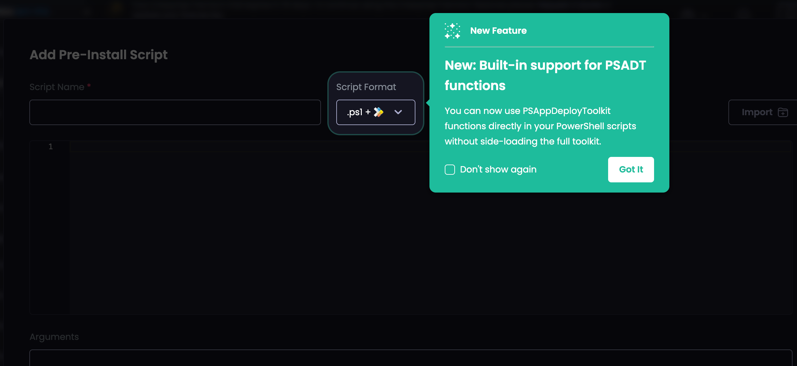
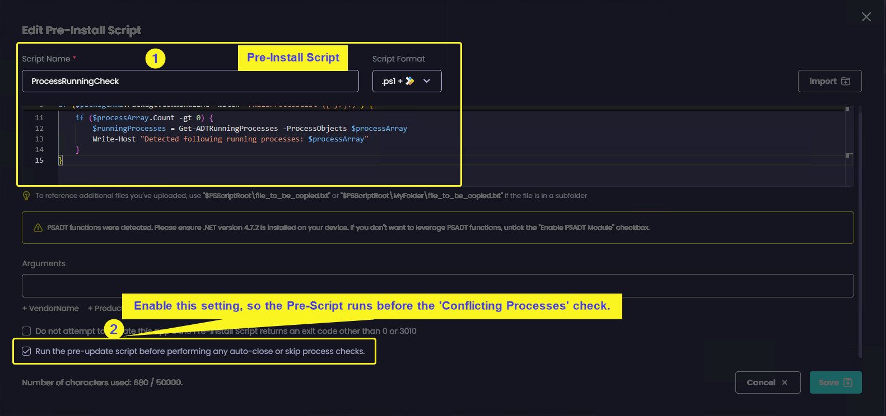
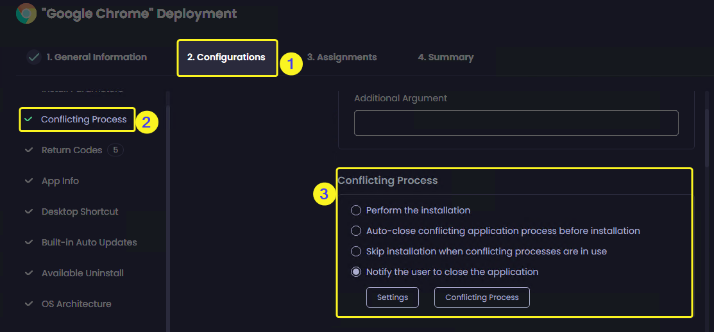
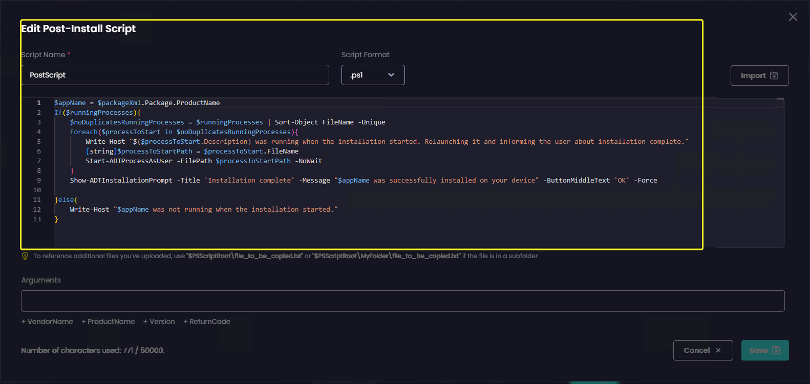
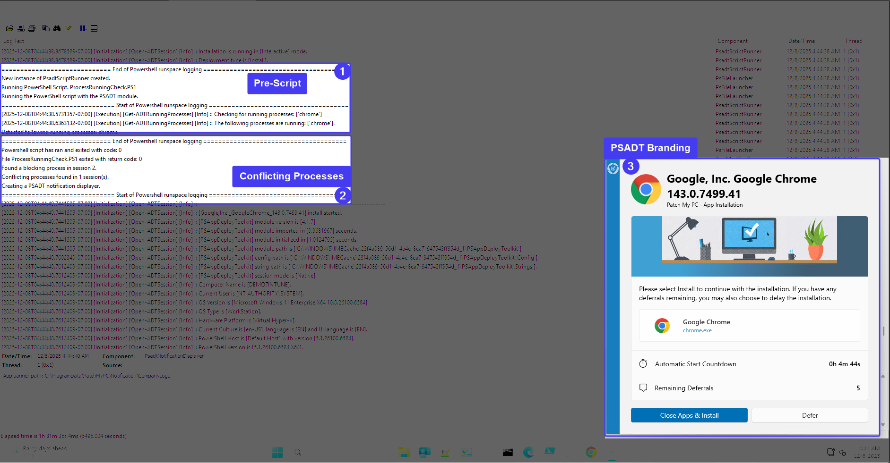

# Patch My PC Cloud Portal – Relaunch closed conflicting processes and inform user

> **⚠️ DISCLAIMER:** The scripts and information provided in this repository are for educational and demonstration purposes only. We are not liable for any damage, data loss, or issues that may occur from running these custom scripts in your environment. Always test thoroughly in a non-production environment before deploying to production systems. Use at your own risk and ensure you understand the implications of the scripts before implementation.

## Introduction

In some deployment scenarios, you may want to perform additional actions after an application is installed or updated on an end user's device. Common examples include:

- Launching the application immediately after installation
- Displaying a message to confirm the installation completed successfully

While some applications provide command-line options to support these actions, others do not. To address this, Patch My PC integrates the PowerShell App Deployment Toolkit (PSADT) into the Cloud Portal, allowing you to leverage its functionality in pre- and post-install scripts.

This article explains how to use PSADT functions to enhance the user experience during application deployments.

## Requirements

- Patch My PC Cloud Portal with Preview Features enabled

> **⚠️ Warning:** Ensure these scripts can run on your clients. Take your PowerShell Execution Policy into account or any other restrictions you might have in place.

## Using PSADT Functions

> **Important:** PSADT functions can only be used with deployments from the Cloud Portal.

After enabling Preview Features, you will receive a message when adding Scripts to any deployments. This indicates that you can use PSADT functions.

As mentioned in the introduction, we will be using a couple examples customers frequently ask about. However, you could use any of the available PSADT functions. We support functions from both PSADT v3 and v4, but **recommend using v4**.

### Example Scenario

In this example, we will leverage some PSADT v4 functions in pre and post scripts. When PSADT functions are referenced, on the client side the same session persists between pre and post scripts. This means we can leverage PSADT functionality between pre and post scripts:

- **Pre-Script**
  - `Get-ADTRunningProcesses` to determine if the process is running. We will put this into a variable.
- **Cloud Portal native conflicting processes** - we will use this native functionality to prompt the end user to close conflicting processes if they exist.
- **Post-Script**
  - `Start-ADTProcessAsUser` to launch the application for the logged on user after it's installed.
  - `Show-ADTInstallationPrompt` to display a message to the end user and inform them the installation is complete. We will only display this prompt if the pre-script concluded the conflicting processes was running. Otherwise, the end user will not see the notification.

> **Info:** This only serves as an example. You are not limited to this exact example.

## Scripts Used in This Example

### Pre-script

You can reuse these scripts as they are without a need to customize them. The information for conflicting processes or app name is taken from `package.xml`, which is a file that contains details about the win32 app created by the Patch My PC Cloud Portal.

**Script Location:** [`Scripts/prescript.ps1`](Scripts/prescript.ps1)

### Post-script

**Script Location:** [`Scripts/postscript.ps1`](Scripts/postscript.ps1)

## Deploying the App

In our example, we will deploy Google Chrome.

We leveraged the Scripts tool to add our pre and post-install scripts.

1. **Add the Pre-Script**
2. **Ensure you enable** the "Run the pre-update script before performing any auto-close or skip process checks". We need to ensure this step runs before the configuration done at step 3.

3. **Turn on the Conflicting Processes setting** and set it to "Notify the user to close the application"
   - The type of notification the end user will receive can be configured on the Branding page. In our example, we used the "Modern (PSADT)" Branding type. At the time this article was written, this feature was in Public Preview.

4. **Add the Post script.**

All that remains is to deploy the app.

## Client Side Behaviour

When installing the app we configured above, we will get the following behaviour.

As PSADT functionality is only available in the Cloud Portal, we can observe the `%ProgramData%\PatchMyPCIntuneLogs\PatchMyPC-ScriptRunner.log`

### Installation Flow

1. **Pre-script execution**: The pre-script runs to check whether there are any conflicting processes running. This will determine the action of the Post-Install script.

2. **Conflicting process management**: The management of conflicting processes kicks in, and the user is notified to close them.

3. **Application installation**: The installation will take place once the conflicting processes are closed.

4. **Post-script execution**: Soon after installation, the Post-Script will run. Because there were conflicting processes running at the Pre-Script evaluation, the user is now informed that the installation is complete, and the application is relaunched - all based on our configuration.

## Files in This Repository

- [`Scripts/prescript.ps1`](Scripts/prescript.ps1) - Pre-installation script that detects running processes
- [`Scripts/postscript.ps1`](Scripts/postscript.ps1) - Post-installation script that relaunches applications and notifies users
